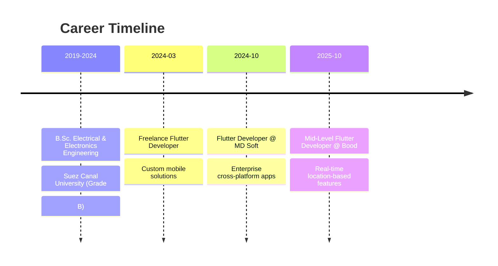

# Hi, I'm Mohamed Naif 👋

<div align="center">
  
[](https://git.io/typing-svg)

</div>

<p align="center">
  <a href="https://linkedin.com/in/mohamed-naif-32483b1b3"></a>
  <a href="mailto:naifm371@gmail.com"></a>
  <a href="https://github.com/MohamedNaif"></a>
</p>

---

## 🎯 About Me

```dart
class MohamedNaif extends FlutterDeveloper {
  final String location = "Cairo, Egypt";
  final int yearsOfExperience = 2+;
  final List<String> platforms = ["Mobile", "Web", "Desktop"];
  
  @override
  String get mission => "Building scalable, cross-platform solutions "
                        "with exceptional UX and robust architecture";
  
  @override
  List<String> get currentFocus => [
    "🚀 Advancing Flutter performance optimization",
    "🏗️ Mastering advanced architectural patterns",
    "📝 Sharing knowledge through technical writing",
    "🌟 Contributing to open-source Flutter packages"
  ];
}
```

🔹 **2+ years** of production Flutter development  
🔹 **6+ enterprise applications** serving thousands of users  
🔹 Specialized in **Clean Architecture**, **BLoC/Cubit**, and **real-time systems**  
🔹 Expert in **Arabic RTL localization** and multilingual applications  
🔹 Published **technical writer** at Eqraatech with 7 Flutter articles  

---

## 🛠️ Tech Arsenal

<table>
<tr>
<td width="50%" valign="top">

### Core Technologies
```yaml
Languages:
  - Dart ⭐⭐⭐⭐⭐
  - Python ⭐⭐⭐⭐
  - C++ ⭐⭐⭐

Frameworks:
  - Flutter (Mobile/Web/Desktop)
  - Firebase Suite
  - REST APIs & WebSockets
```

</td>
<td width="50%" valign="top">

### Architecture & Patterns
```yaml
Design Patterns:
  - Clean Architecture
  - MVVM & MVC
  - Repository Pattern
  - Singleton & Factory

State Management:
  - BLoC & Cubit
  - GetIt (Dependency Injection)
  - GoRouter (Navigation)
```

</td>
</tr>
</table>

<details>
<summary>📦 <b>Complete Tech Stack</b></summary>

<br>

**Mobile Development**  


**State Management & Architecture**  


**Backend & Database**  


**Development Tools**  


</details>

---

## 💼 Professional Journey



### 🏢 Current Role: Mid-Level Flutter Developer @ **Bood**
*October 2025 - Present | Cairo, Egypt*

- Building high-performance cross-platform mobile applications
- Implementing **Google Maps** integration for real-time tracking
- Architecting scalable RESTful API integrations
- Delivering clean UI with smooth performance

---

## 🚀 Featured Projects

<table>
<tr>
<td width="50%">

### 🚚 [SWiFT Delivery Platform](https://play.google.com/store/apps/details?id=com.swift.merchant)

**Enterprise Fleet Management Ecosystem**

📱 3 Mobile Apps + 1 Windows Desktop  
⚡ Real-time order tracking with WebSockets  
🎯 QR verification & wallet system  
🌍 Arabic RTL localization  
📊 Analytics dashboards

**Tech:** Flutter • BLoC • WebSockets • Firebase  
**Platforms:** Android, iOS, Web, Windows

[🔗 Merchant App](https://play.google.com/store/apps/details?id=com.swift.merchant) | [🔗 Driver App](https://play.google.com/store/apps/details?id=com.swift.driver)

</td>
<td width="50%">

### 🎁 [GB GHADIR Loyalty Network](https://play.google.com/store/apps/details?id=com.mdsoft.gb_ghadir)

**Multi-Role Loyalty Management Suite**

👥 Agent, Technician & Admin interfaces  
💳 Wallet transfers & rewards redemption  
🗺️ Google Maps delivery selection  
📦 Order tracking with live updates  
📊 Export services (Excel/PDF)

**Tech:** Flutter • BLoC • GetIt • GoRouter  
**Features:** Multi-step OTP, Role-based auth

[🔗 Google Play](https://play.google.com/store/apps/details?id=com.mdsoft.gb_ghadir)

</td>
</tr>
<tr>
<td width="50%">

### 🎯 Tawfeer Loyalty System

**Customer Rewards & Points Platform**

💰 Send, receive & redeem loyalty points  
🏪 Company & product management  
📱 Order tracking & transaction history  
👥 Multi-role support (Admin/Employee/Customer)  
🔔 Push notifications for promotions

**Tech:** Flutter • BLoC • Firebase  
**Focus:** Secure auth, Arabic RTL UI

</td>
<td width="50%">

### 🎓 Conference Registration System

**Event Management Platform**

📝 Dynamic registration forms  
💵 Multi-package pricing engine  
📲 SMS verification system  
⚡ Real-time approval dashboard  
🔍 Advanced search with pagination

**Tech:** Flutter • Clean Architecture • BLoC  
**Components:** Mobile App + Admin Panel

</td>
</tr>
</table>

---

## 📊 GitHub Analytics

<p align="center">
  
  
</p>

<p align="center">
  
  
</p>

---

## 🏆 Key Achievements

<table>
<tr>
<td align="center" width="25%">

<br><b>6+ Projects</b>
<br>Production Apps
</td>
<td align="center" width="25%">

<br><b>Thousands</b>
<br>Active Users
</td>
<td align="center" width="25%">

<br><b>7 Articles</b>
<br>Technical Writing
</td>
<td align="center" width="25%">

<br><b>Grade A</b>
<br>Graduation Project
</td>
</tr>
</table>

---

## 🎓 Education & Certifications

**🎓 B.Sc. Electrical & Electronics Engineering**  
*Suez Canal University (2019-2024)* • Grade: **B** • Graduation Project: **A**

**📜 Professional Development**
- 📱 Mobile Application Development - *Information Technology Institute (ITI)*
- ✍️ Technical Writing - *Eqraatech* (7 published Flutter articles)

**🌟 Community Involvement**
- Technical Writer @ Eqraatech
- Active Member @ ICPC Suez Canal University Community

---

## 💡 Core Competencies

<details>
<summary><b>🏗️ Software Architecture & Design</b></summary>

- ✅ Clean Architecture implementation with clear separation of concerns
- ✅ SOLID principles for maintainable, scalable code
- ✅ Design patterns: MVVM, Repository, Singleton, Factory
- ✅ Dependency injection with GetIt
- ✅ Modular, testable code structure

</details>

<details>
<summary><b>⚡ Performance & Optimization</b></summary>

- ✅ Efficient BLoC/Cubit state management
- ✅ Optimized widget lifecycle & memory management
- ✅ Network optimization with caching strategies
- ✅ Lazy loading & pagination for large datasets
- ✅ Background task handling & isolates

</details>

<details>
<summary><b>🌍 Localization & Accessibility</b></summary>

- ✅ Arabic RTL support & multilingual interfaces
- ✅ Responsive design for all screen sizes
- ✅ Accessibility standards implementation
- ✅ Dynamic theme switching
- ✅ Cultural considerations in UX

</details>

<details>
<summary><b>🔄 Real-Time & Integration</b></summary>

- ✅ WebSocket & Socket.IO for real-time updates
- ✅ RESTful API integration & error handling
- ✅ Firebase services (Auth, Firestore, FCM)
- ✅ Google Maps integration
- ✅ Push notifications & in-app messaging

</details>

---

## 📫 Let's Connect

<p align="center">
  
I'm always open to discussing new opportunities, technical challenges, and innovative Flutter solutions.

**💼 Open to:** Full-time positions | Remote work | Exciting Flutter projects

<br>

<a href="https://linkedin.com/in/mohamed-naif-32483b1b3">
  
</a>
<a href="mailto:naifm371@gmail.com">
  
</a>
<a href="https://github.com/MohamedNaif">
  
</a>

</p>

---

<p align="center">
  
</p>

<p align="center">
  <i>"Building scalable, cross-platform solutions that bridge the gap between exceptional user experience and robust technical architecture."</i>
</p>

<p align="center">
  
</p>
